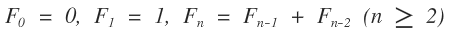
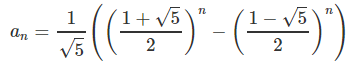

# Problem 0002 - Even Fibonacci numbers
## 1. Problem
___Each new term in the Fibonacci sequence is generated by adding the previous two terms. By starting with 1 and 2, the first 10 terms will be:___

___1, 2, 3, 5, 8, 13, 21, 34, 55, 89, ...___

___By considering the terms in the Fibonacci sequence whose values do not exceed four million, find the sum of the even-valued terms.___


## 2. Solution
##### (1) Fibonacci general term


##### (2) Formula of Fibonacci sequence


##### (3) Pesudo code
Anyway, this problem is not 'the n-th Fibonacci number'. I have to find the sum of even-valued terms untill the final term exceeds four million. So, I solved using simply swap.


```cpp
// A general term of fibonacci sequence -> f(n+2) = f(n+1) + f(n)
// cur -> f(n+2) or f(n+1)
// last -> f(n)
// tmp -> To store cur(f(n+1)) in last(f(n)) for the next loop

limit <- 4000000
sum <- 2;
tmp <- 0, last <- 1, cur <- 2;

while(cur < LIMIT) {
    tmp <- cur, cur <- cur + last, last <- tmp;

    if(cur % 2 == 0) sum = sum + cur;
}

```
