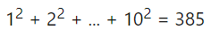

# Problem 0006 - Sum square difference
## 1. Problem
___The sum of the squares of the first ten natural numbers is,___

___The square of the sum of the first ten natural numbers is,___

___Hence the difference between the sum of the squares of the first ten natural numbers and the square of the sum is 3025 − 385 = 2640.___

___Find the difference between the sum of the squares of the first one hundred natural numbers and the square of the sum.___

## 2. Solution